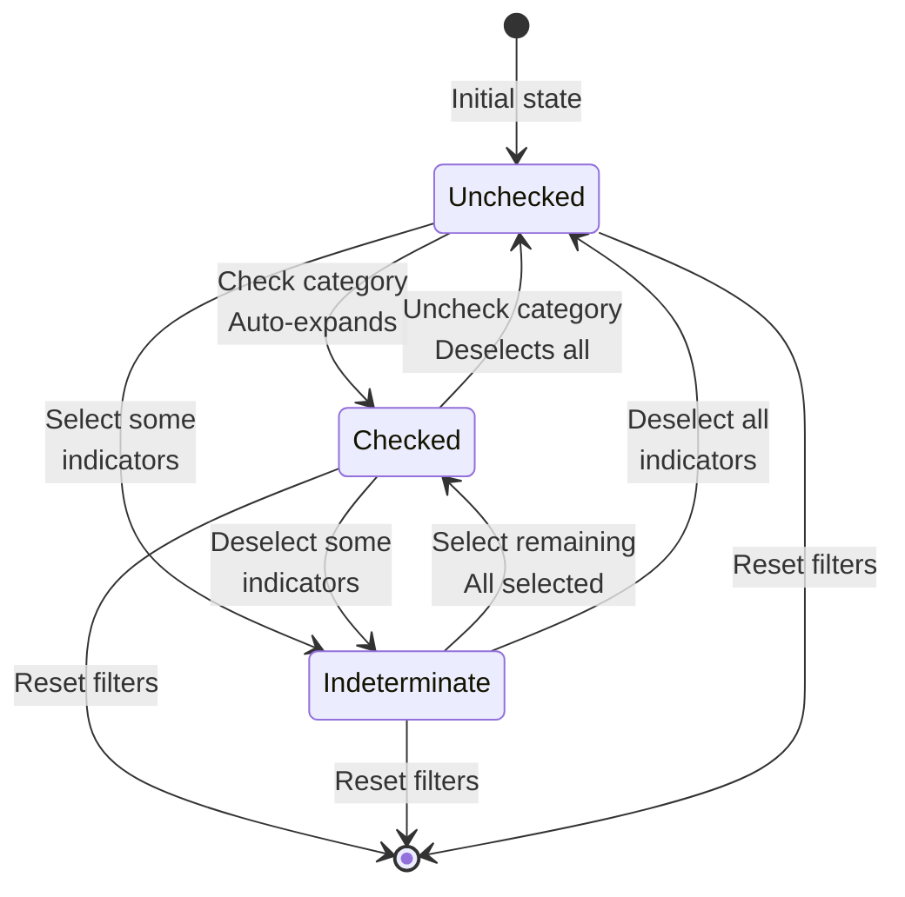
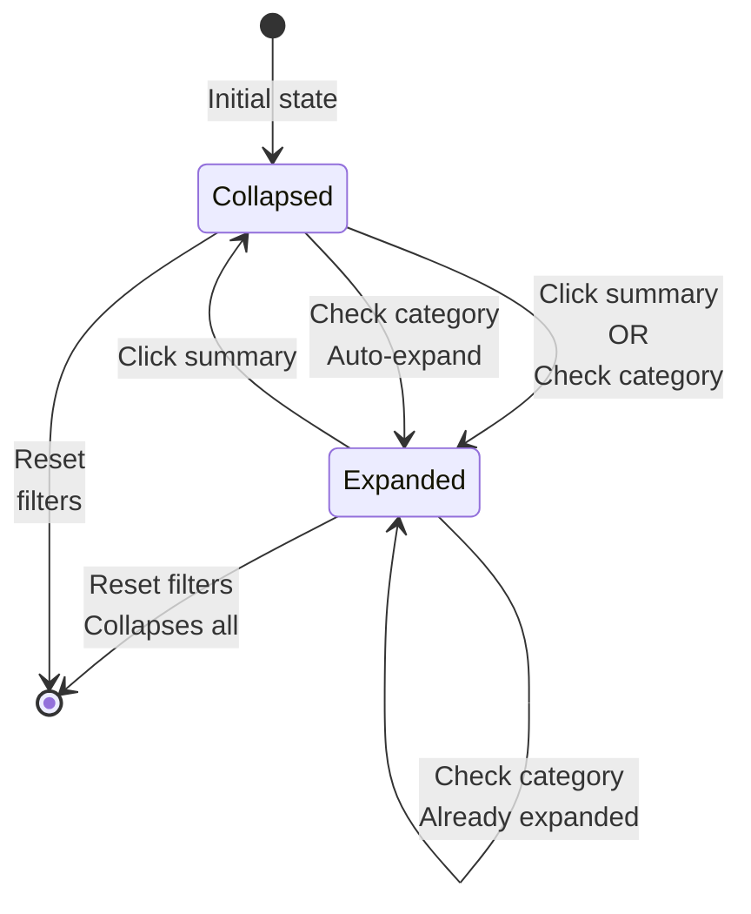
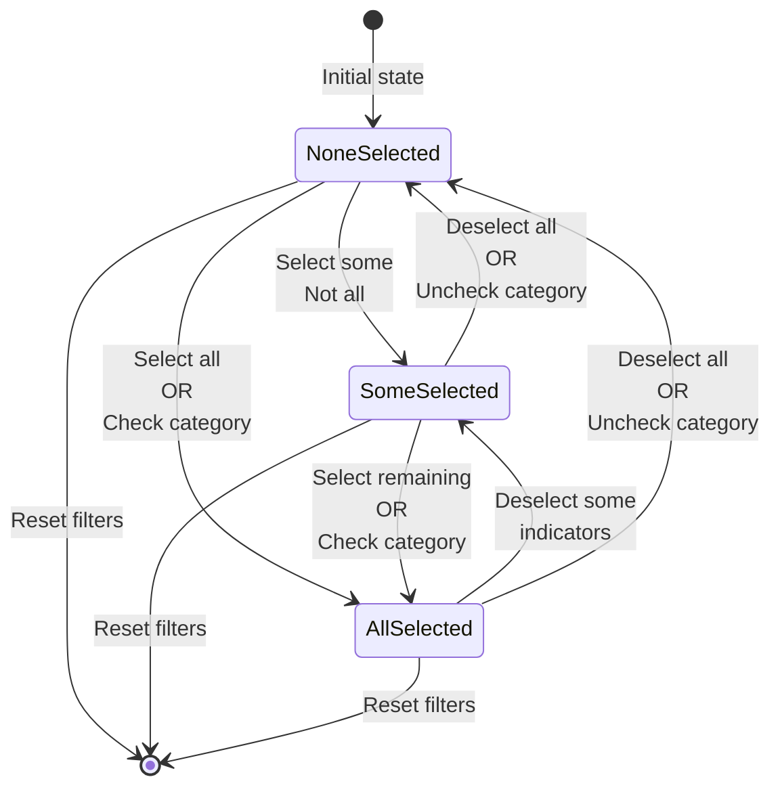
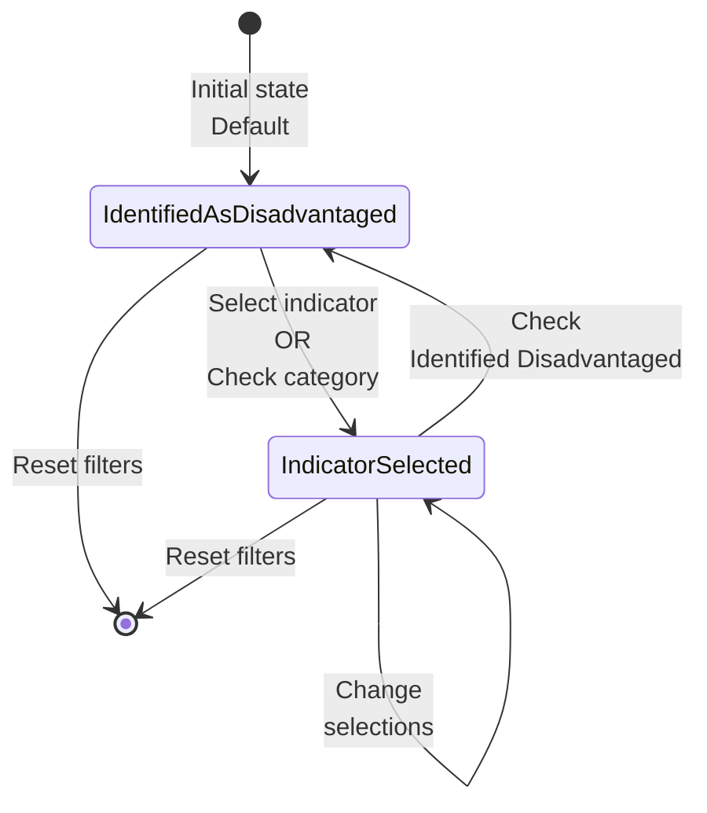
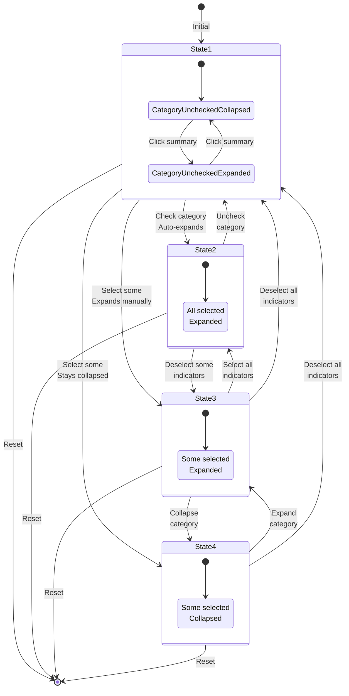

# LayerFilter Component - State Diagram

## Category Checkbox State Machine

## Category Expand/Collapse State Machine

## Indicator Selection State Machine (per category)

## Overall Filter State Machine

## Combined Category State Diagram

## State Transition Table

| Current State | Action | Next State | Side Effects |
|--------------|--------|-----------|--------------|
| Category Unchecked, Collapsed | Check category | Category Checked, Expanded | All indicators selected, Auto-expand |
| Category Unchecked, Collapsed | Select some indicators | Category Indeterminate, Expanded/Collapsed | Category becomes checked with indeterminate |
| Category Unchecked, Expanded | Check category | Category Checked, Expanded | All indicators selected |
| Category Checked, Expanded | Uncheck category | Category Unchecked, Expanded | All indicators deselected |
| Category Checked, Expanded | Deselect some indicators | Category Indeterminate, Expanded | Category shows indeterminate |
| Category Indeterminate, Expanded | Select all indicators | Category Checked, Expanded | Indeterminate clears |
| Category Indeterminate, Expanded | Deselect all indicators | Category Unchecked, Expanded | Category becomes unchecked |
| Category Indeterminate, Collapsed | Expand category | Category Indeterminate, Expanded | No state change |
| Any state | Reset filters | Category Unchecked, Collapsed | All selections cleared |

## Key State Variables

### Category State
- `categoryStates[categoryId]`: boolean - Whether category checkbox is checked
- `categoryCheckboxRefs[categoryId].indeterminate`: boolean - Whether category shows indeterminate state
- `expandedCategories`: Set<string> - Which categories are expanded

### Filter State
- `filters.identifiedAsDisadvantaged`: boolean - Main filter state
- `filters.indicators`: {[key: string]: boolean} - Individual indicator selections

### Derived States
- **Category Checked**: `categoryStates[categoryId] === true && indeterminate === false`
- **Category Unchecked**: `categoryStates[categoryId] === false && indeterminate === false`
- **Category Indeterminate**: `categoryStates[categoryId] === true && indeterminate === true`
- **All Indicators Selected**: `selectedCount === category.indicators.length`
- **Some Indicators Selected**: `selectedCount > 0 && selectedCount < category.indicators.length`
- **No Indicators Selected**: `selectedCount === 0`

